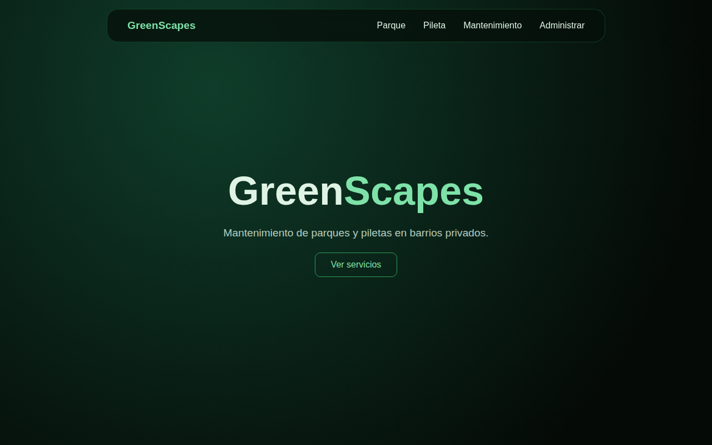
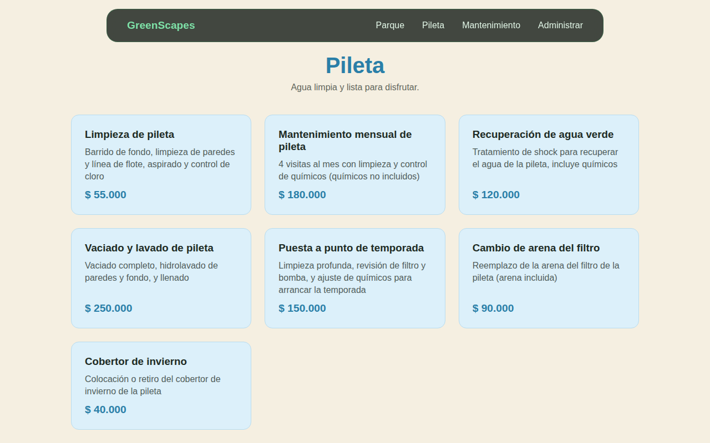
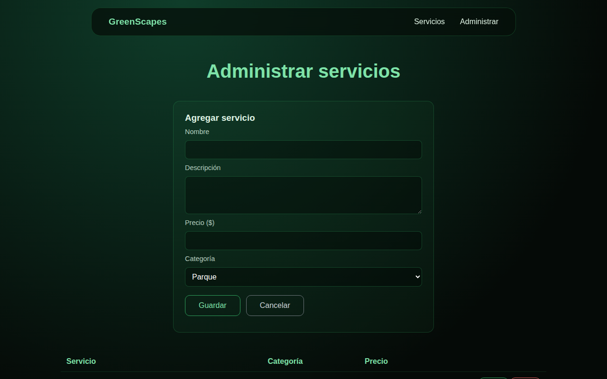
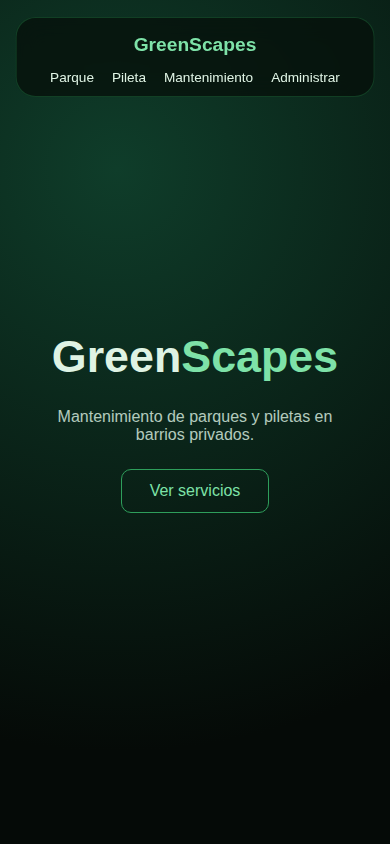

# GreenScapes — TP Full Stack

**Nombre y apellido:** _completar_
**Curso:** _completar_

---

## Descripción del tema

GreenScapes es una agencia (ficticia) de mantenimiento de parques y piletas en barrios privados. La app tiene:

- Una **página pública** (`index.html`) con el catálogo de servicios, separado en tres categorías: **Parque**, **Pileta** y **Mantenimiento**.
- Un **panel de administración** (`admin.html`) para agregar, editar y borrar servicios.
- Una **API** hecha con FastAPI que guarda los servicios en una base de datos SQLite.

Cada servicio tiene nombre, descripción, precio y categoría.

## Tecnologías usadas

| Tecnología | Para qué se usa |
|---|---|
| **Python** | Lenguaje del backend |
| **FastAPI** | Framework para crear la API y sus endpoints |
| **Uvicorn** | Servidor que ejecuta la API |
| **Pydantic** | Valida los datos que llegan en el body de las peticiones |
| **SQLite** | Base de datos, guardada en el archivo `backend/database/db.db` |
| **HTML y CSS** | Estructura y diseño de las páginas |
| **JavaScript (fetch)** | Conecta el frontend con la API |

## Instalación y ejecución (paso a paso)

Requisitos: tener instalado **Python 3.9 o más nuevo** y **Git**.

1. Clonar el repositorio:
   ```bash
   git clone https://github.com/Enzis123/full-stackiiiiiiiiiii.git
   cd full-stackiiiiiiiiiii
   ```
2. Crear y activar un entorno virtual:
   ```bash
   python -m venv env
   env\Scripts\activate          # Windows
   # source env/bin/activate     # Linux o Mac
   ```
3. Instalar las dependencias:
   ```bash
   cd backend
   pip install -r requirements.txt
   ```
4. Levantar la API:
   ```bash
   uvicorn main:app --reload
   ```
   La API queda en http://127.0.0.1:8000 y la documentación automática en http://127.0.0.1:8000/docs.
5. Abrir el frontend: abrir el archivo `greenscapes/index.html` en el navegador (con doble clic o con la extensión Live Server de VS Code). La API tiene que estar corriendo.

## Endpoints

| Método | Ruta | Descripción |
|---|---|---|
| GET | `/ver_servicios` | Lista todos los servicios |
| GET | `/ver_servicio/{id}` | Busca un servicio por id |
| POST | `/agregar_servicios` | Crea un servicio |
| PUT | `/editar_servicio/{id}` | Edita un servicio |
| DELETE | `/borrar_servicio/{id}` | Borra un servicio |

### Ejemplos de request y response

**Listar servicios**
```http
GET /ver_servicios
```
```json
[
  {"id": 5, "servicio": "Corte de pasto chico", "descripcion": "Corte de pasto hasta 100m2, incluye bordeado y retiro de restos", "precio": 60000.0, "categoria": "Parque"},
  {"id": 15, "servicio": "Limpieza de pileta", "descripcion": "Barrido de fondo, limpieza de paredes y línea de flote, aspirado y control de cloro", "precio": 55000.0, "categoria": "Pileta"}
]
```

**Buscar un servicio**
```http
GET /ver_servicio/5
```
```json
{"id": 5, "servicio": "Corte de pasto chico", "descripcion": "Corte de pasto hasta 100m2, incluye bordeado y retiro de restos", "precio": 60000.0, "categoria": "Parque"}
```
Si el id no existe:
```json
{"mensaje": "No existe un servicio con ese id"}
```

**Crear un servicio**
```http
POST /agregar_servicios
Content-Type: application/json

{"servicio": "Limpieza de filtro", "descripcion": "Limpieza del filtro de la pileta", "precio": 30000, "categoria": "Pileta"}
```
```json
{"mensaje": "Servicio agregado"}
```

**Editar un servicio**
```http
PUT /editar_servicio/31
Content-Type: application/json

{"servicio": "Limpieza de filtro", "descripcion": "Limpieza del filtro de la pileta", "precio": 35000, "categoria": "Pileta"}
```
```json
{"mensaje": "Servicio editado"}
```

**Borrar un servicio**
```http
DELETE /borrar_servicio/31
```
```json
{"mensaje": "Servicio borrado"}
```

**Request inválido** (falta `descripcion` y `categoria`, y el precio no es un número)
```http
POST /agregar_servicios
Content-Type: application/json

{"servicio": "Poda", "precio": "mucho"}
```
Respuesta con código **422**:
```json
{
  "detail": [
    {"type": "missing", "loc": ["body", "descripcion"], "msg": "Field required"},
    {"type": "float_parsing", "loc": ["body", "precio"], "msg": "Input should be a valid number, unable to parse string as a number"},
    {"type": "missing", "loc": ["body", "categoria"], "msg": "Field required"}
  ]
}
```

## Capturas de pantalla

**Inicio**


**Catálogo de servicios**


**Panel de administración**


**Vista en celular**



## Criterios de diseño

- **Dos páginas separadas:** el catálogo (`index.html`) solo muestra servicios y la administración (`admin.html`) tiene agregar, editar y borrar. Así el cliente que mira los servicios no ve los botones de administración.
- **Colores por categoría:** Parque en verde clarito y blanco, Pileta en beige claro y celeste claro, Mantenimiento en gris y blanco. La portada y el panel de administración usan verde oscuro con negro.
- **HTML, CSS y JavaScript sin frameworks**, para que el código sea simple y fácil de entender.
- **Backend separado en capas:** `database/` (conexión), `models/` (modelo de datos), `managers/` (consultas a la base) y `main.py` (endpoints).
- **SQLite** como base de datos, porque es un solo archivo y no hace falta instalar un servidor de base de datos.

## Preguntas de arquitectura cliente-servidor

### Pregunta 1 — El ciclo de vida de una petición

_Respuesta pendiente + diagrama de secuencia de la petición POST._

### Pregunta 2 — ¿Quién es el cliente y quién es el servidor?

_Respuesta pendiente + diagrama de arquitectura general._

### Pregunta 3 — HTTP como lenguaje común

_Respuesta pendiente._

| Operación | Método | Ruta | Código de éxito | Código de error |
|---|---|---|---|---|
| Crear | | | | |
| Listar | | | | |
| Buscar uno | | | | |
| Editar | | | | |
| Borrar | | | | |

### Pregunta 4 — CORS

_Respuesta pendiente + diagrama del flujo CORS._

### Pregunta 5 — Separación de responsabilidades

_Respuesta pendiente._

### Pregunta 6 — JSON como formato de intercambio

_Respuesta pendiente._

### Pregunta 7 — Statelessness (sin estado)

_Respuesta pendiente._
