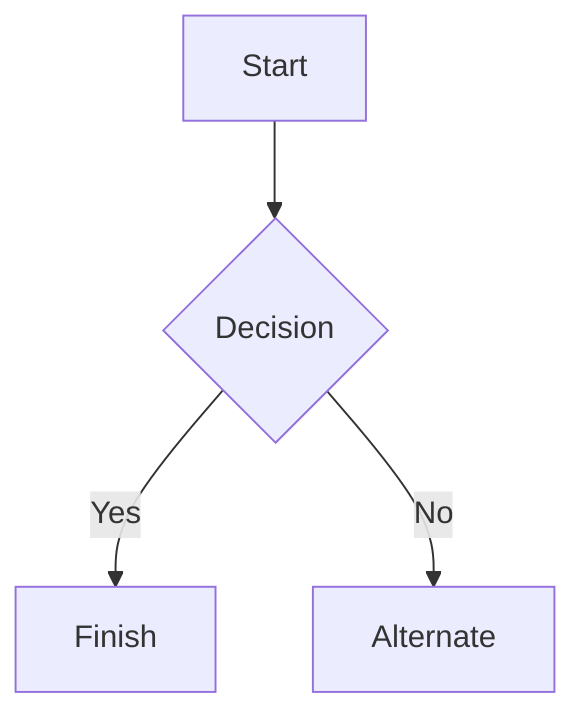

# GreenScapes TP FULL-STACK

### Alumno: Enzo Benjamin Romero
### Curso: 6to 5ta
## ¿Qué es `GreenScapes`?

* **GreenScapes** es un empresa de mi familia, esta misma se dedica a ofrecer servicios de mantenimiento y cuidado de `Parques`, `Piletas`, y los distitos tipos de `espacios` que se encuentra en los lotes particulares, o de barrios abiertos o cerrados. 

* Tomé la decisión, de utilizar esta empresa para desarrollar mi proyecto, debido a que se necesita para esta misma una pagina web, sobre la empresa, y otro tipo de aplicaciones para dispositivos moviles, y lo vi como el mejor ejemplo a seguir, para aprender a desarrollar una app FullStack.

## Criterios de Diseño

### ``Frontend``
* **Estructura**: utilice una estructura básica, una que nos enseñaron en clase de diseño web estatico. La estrucutra se basa

  ```
  <header>
      <nav>
          <a href="index.html" class="logo">GreenScapes</a>
          <ul>
              <li><a href="#parque">Parque</a></li>
              <li><a href="#pileta">Pileta</a></li>
              <li><a href="#mantenimiento">Mantenimiento</a></li>
              <li><a href="admin.html">Administrar</a></li>
          </ul>
      </nav>
  </header>

  <main>

  <section class="inicio_section">
      <h1>Green<span>Scapes</span></h1>
      <p>Mantenimiento de parques y piletas en barrios privados.</p>
      <a href="#parque" class="btn">Ver servicios</a>
  </section>

  <section id="parque" class="servicios_section parque">
      <h2>Parque</h2>
      <p class="subtitulo">Césped, poda y todo lo verde.</p>
      <div id="lista_parque" class="grid"></div>
  </section>

  <section id="pileta" class="servicios_section pileta">
      <h2>Pileta</h2>
      <p class="subtitulo">Agua limpia y lista para disfrutar.</p>
      <div id="lista_pileta" class="grid"></div>
  </section>

  <section id="mantenimiento" class="servicios_section mantenimiento">
      <h2>Mantenimiento</h2>
      <p class="subtitulo">Nos ocupamos de los detalles de tu casa.</p>
      <div id="lista_mantenimiento" class="grid"></div>
  </section>

  </main>

  <footer>
      <p>&copy; GreenScapes · Barrios privados</p>
  </footer>

  <script src="servicios.js"></script>
  </body>
  </html>

  ```
* **Colores**: Los colores estan basados en las áreas de trabajo de la Empresa, se encuentra colores como verdes, claros, oscuros, por relaciones con los parques. Celeste claro, beiges, por la relacion con las piletas.

* **Colores Utilizados**:
  * ` -negro: #050a07;`
  * ``--verde_oscuro: #0f3d2a;``
  * ``--verde: #2e9e5b;``
  * ``--verde_clarito: #dff3e4;``
  * ``--blanco: #ffffff;``
  * ``--beige: #f5efe1;``
  * ``--celeste: #dcf0fa;``
  * ``--azul: #2a7fa8;``
  * ``--gris_claro: #eef0f1;``
  * ``--gris: #6b7479;``
### Ordered

1. Item 1
2. Item 2
3. Item 3
    1. Item 3a
    2. Item 3b

## Images


## Links

You may be using [Markdown Live Preview](https://markdownlivepreview.com/).

## Blockquotes

> Markdown is a lightweight markup language with plain-text-formatting syntax, created in 2004 by John Gruber with Aaron Swartz.
>
>> Markdown is often used to format readme files, for writing messages in online discussion forums, and to create rich text using a plain text editor.

## Tables

| Left columns  | Right columns |
| ------------- |:-------------:|
| left foo      | right foo     |
| left bar      | right bar     |
| left baz      | right baz     |

## Blocks of code

```
let message = 'Hello world';
alert(message);
```

## Mermaid diagrams


## Inline code

This web site is using `markedjs/marked`.
