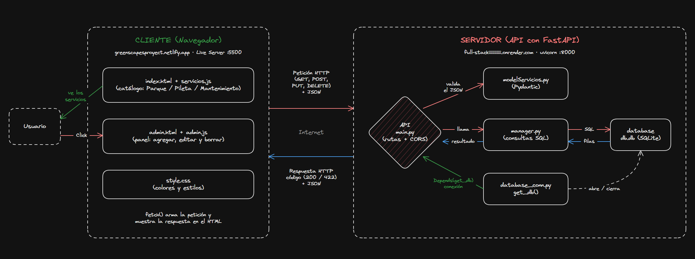
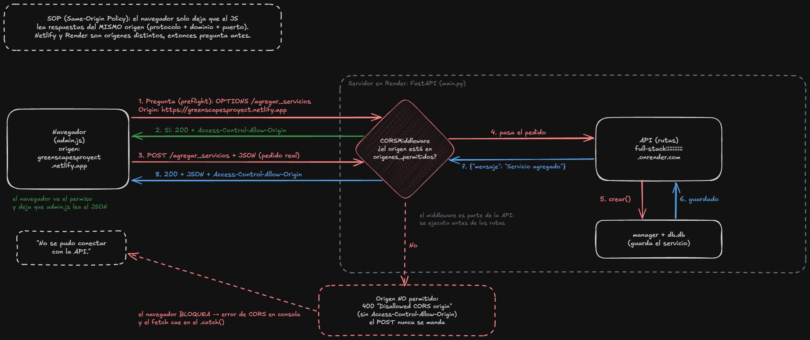

# GreenScapes — TP Full Stack

**Nombre y apellido:** _completar_  
**Curso:** _completar_

---

## Descripción del tema

GreenScapes es una agencia ficticia de mantenimiento de parques y piletas en barrios privados.

La app tiene:

- Una página pública (`index.html`) con los servicios separados en **Parque, Pileta y Mantenimiento**.
- Un panel de administración (`admin.html`) para **agregar, editar y borrar** servicios.
- Una API hecha con **FastAPI** que guarda los datos en **SQLite**.

Cada servicio tiene nombre, descripción, precio y categoría.

## Tecnologías usadas

| Tecnología | Para qué se usa |
|---|---|
| Python | Backend |
| FastAPI | API y endpoints |
| Uvicorn | Ejecuta el servidor |
| Pydantic | Valida los datos |
| SQLite | Guarda los servicios |
| HTML y CSS | Página y diseño |
| JavaScript + fetch | Conecta la página con la API |

## Instalación y ejecución

Requisitos: Python 3.9 o más nuevo y Git.

```bash
git clone https://github.com/Enzis123/full-stackiiiiiiiiiii.git
cd full-stackiiiiiiiiiii
python -m venv env
env\Scripts\activate
cd backend
pip install -r requirements.txt
uvicorn main:app --reload
```

La API queda en `http://127.0.0.1:8000` y la documentación en `http://127.0.0.1:8000/docs`.

Después abrir `greenscapes/index.html` o `admin.html`.

---

## Endpoints

| Operación | Método | Ruta | Qué hace |
|---|---|---|---|
| Crear | POST | `/agregar_servicios` | Crea un servicio |
| Listar | GET | `/ver_servicios` | Muestra todos |
| Buscar uno | GET | `/ver_servicio/{id}` | Busca por id |
| Editar | PUT | `/editar_servicio/{id}` | Edita un servicio |
| Borrar | DELETE | `/borrar_servicio/{id}` | Borra un servicio |

### Códigos importantes

- **200:** salió bien.
- **201:** sería el código correcto al crear, aunque actualmente la API devuelve 200.
- **404:** no encontrado. Actualmente la API no lo usa para un id inexistente.
- **422:** los datos enviados no cumplen el modelo de Pydantic.
- **500:** error interno del servidor.

---

# Preguntas de arquitectura cliente-servidor

## Pregunta 1 — El ciclo de vida de una petición

Cuando toco **Guardar** en `admin.html` pasa esto:

1. `guardar()` toma los datos del formulario.
2. `event.preventDefault()` evita que se recargue la página.
3. JavaScript arma el objeto `datos`.
4. `fetch()` manda un **POST** a `/agregar_servicios` y `JSON.stringify()` convierte los datos a JSON.
5. Uvicorn recibe el pedido y FastAPI busca la función correspondiente.
6. **Pydantic** revisa los datos. Si falta algo o el precio no es un número, devuelve **422** y no toca la base.
7. `Depends(get_db)` abre la conexión a SQLite.
8. `manager.crear()` hace el `INSERT` y `commit()`. Ahí se guarda realmente el dato.
9. La API devuelve `{"mensaje": "Servicio agregado"}` con código 200.
10. Se cierra la conexión.
11. `admin.js` recibe la respuesta, muestra el mensaje, limpia el formulario y hace otro `GET /ver_servicios` para actualizar la tabla.

**En resumen:** `admin.js → FastAPI → Pydantic → get_db → manager → SQLite → respuesta → actualizar tabla`.


---

## Pregunta 2 — ¿Quién es el cliente y quién es el servidor?

El **cliente** es el navegador, que ejecuta el HTML, CSS y JavaScript de `greenscapes/`.

El **servidor** es FastAPI, que corre con Uvicorn en el puerto `8000`.

El navegador y la API se comunican por **HTTP** y mandan los datos en **JSON**.

La base `db.db` está del lado del servidor. El navegador nunca entra directamente a SQLite.

A diferencia de una app de escritorio, acá la interfaz y los datos están separados. Los datos están centralizados en el servidor.



---

## Pregunta 3 — HTTP como lenguaje común

**HTTP** es el conjunto de reglas que usa el navegador para comunicarse con la API.

Un pedido tiene principalmente:

- **Método:** GET, POST, PUT o DELETE.
- **Ruta:** por ejemplo `/ver_servicios`.
- **Headers:** información extra, como `Content-Type: application/json`.
- **Body:** los datos enviados, principalmente en POST y PUT.

La respuesta tiene un código de estado y un body, que en este proyecto es JSON.

### Tabla de la API

| Operación | Método | Ruta | Éxito | Error |
|---|---|---|---|---|
| Crear | POST | `/agregar_servicios` | 200 | 422 |
| Listar | GET | `/ver_servicios` | 200 + lista JSON | — |
| Buscar uno | GET | `/ver_servicio/{id}` | 200 + servicio | 422 si el id no es entero |
| Editar | PUT | `/editar_servicio/{id}` | 200 | 422 |
| Borrar | DELETE | `/borrar_servicio/{id}` | 200 | 422 |

Un detalle: si el id es un número pero no existe, actualmente la API devuelve 200. Lo ideal sería devolver 404.

---

## Pregunta 4 — CORS

CORS sirve para que el navegador pueda aceptar respuestas de una API que está en otro origen.

Un origen está formado por:

**protocolo + dominio + puerto**

Por ejemplo:

- Frontend: `http://127.0.0.1:5500`
- API: `http://127.0.0.1:8000`

Como cambia el puerto, son orígenes distintos.

En `main.py` se usa `CORSMiddleware` con:

```python
allow_origins=["*"]
allow_methods=["*"]
allow_headers=["*"]
```

Eso permite que cualquier origen pueda usar la API. Para producción sería mejor poner solamente el dominio necesario.

En pedidos como POST, PUT o DELETE, el navegador puede hacer primero un **OPTIONS**, llamado preflight, para preguntar si tiene permiso. Después manda el pedido real.

Importante: **CORS no protege la API contra Postman, curl o scripts**. Es una regla que aplica el navegador.



---

## Pregunta 5 — Separación de responsabilidades

Cada parte del backend tiene una función:

| Archivo | Qué hace |
|---|---|
| `main.py` | Rutas y respuestas HTTP |
| `manager.py` | Consultas SQL |
| `database_conn.py` | Abre y cierra la conexión |
| `modelServicios.py` | Define y valida cómo es un servicio |

La idea es no mezclar todo en un solo archivo.

Por ejemplo, `main.py` recibe el pedido, pero no hace directamente el SQL. El manager se encarga de eso.

### ¿Qué hace `Depends(get_db)`?

Le dice a FastAPI que antes de ejecutar la ruta tiene que llamar a `get_db()` y pasarle la conexión.

`get_db()` abre la conexión, la presta con `yield` y después la cierra en `finally`.

Así cada pedido usa su conexión y esta se cierra aunque haya un error.

---

## Pregunta 6 — JSON como formato de intercambio

**JSON** es un formato de texto con claves y valores que sirve para pasar datos entre el navegador y la API.

Ejemplo:

```json
{
  "id": 5,
  "servicio": "Corte de pasto chico",
  "descripcion": "Corte de pasto hasta 100m2",
  "precio": 60000.0,
  "categoria": "Parque"
}
```

JavaScript y Python pueden trabajar fácilmente con JSON.

En el frontend:

```javascript
JSON.stringify(datos)
```

convierte el objeto de JavaScript en texto JSON para enviarlo.

Y:

```javascript
res.json()
```

convierte la respuesta JSON en un objeto que JavaScript puede usar.

Si los datos no cumplen el modelo de Pydantic, la API devuelve **422** y no guarda nada.

---

## Pregunta 7 — Statelessness (sin estado)

**Stateless** significa que el servidor no depende de recordar las peticiones anteriores.

Cada pedido tiene que traer la información necesaria para poder responder.

En GreenScapes, los servicios no quedan guardados en la memoria de FastAPI. Los datos están en SQLite.

Además, `get_db()` abre una conexión para la petición y la cierra al terminar.

Por eso, si se reinicia Uvicorn, los servicios siguen estando en `db.db`.

Si el proyecto creciera y tuviera varios servidores, todos podrían atender pedidos porque la API no depende de datos guardados en la memoria de un servidor. Para hacerlo realmente con varios servidores habría que usar una base compartida, como PostgreSQL o MySQL, porque SQLite es un archivo local.

---

## Preguntas rápidas que puede hacer el profe

**¿Qué hace `Depends`?**  
Le dice a FastAPI que ejecute `get_db()` y le pase la conexión a la función.

**¿Qué pasa si apago la API?**  
Las páginas pueden abrirse, pero los `fetch` fallan y no aparecen los servicios. Los datos siguen guardados en SQLite.

**¿Por qué aparece un 422?**  
Porque los datos no cumplen el modelo de Pydantic.

**¿Dónde se guardan los datos?**  
En `backend/database/db.db`, en la tabla `servicios`.

**¿Qué es Uvicorn?**  
Es el servidor que ejecuta la API y escucha en `127.0.0.1:8000`.

**¿Por qué hay dos páginas?**  
`index.html` es para mostrar el catálogo y `admin.html` para administrarlo.

**¿Qué hace `preventDefault()`?**  
Evita que el formulario recargue la página para poder manejarlo con JavaScript.

**¿Qué diferencia hay entre POST y PUT?**  
POST crea un servicio nuevo y PUT modifica uno que ya existe.

**¿Qué es SQLite?**  
Es una base de datos que se guarda en un archivo y no necesita un servidor aparte.

---

## Glosario rápido

- **API:** programa que permite que otros programas hagan pedidos y reciban datos.
- **Endpoint:** una ruta de la API.
- **HTTP:** reglas para comunicarse entre cliente y servidor.
- **JSON:** formato para intercambiar datos.
- **CORS:** permiso para que el navegador pueda leer respuestas de otro origen.
- **Pydantic:** valida los datos.
- **FastAPI:** framework usado para crear la API.
- **Uvicorn:** ejecuta el servidor.
- **SQLite:** base de datos guardada en un archivo.
- **CRUD:** crear, leer, actualizar y borrar.
- **fetch:** función de JavaScript para hacer pedidos HTTP.
- **Stateless:** el servidor no guarda el estado de las peticiones anteriores.

---

## Para la exposición

La idea principal de GreenScapes es:

**Navegador → API FastAPI → SQLite**

El navegador pide o manda datos, FastAPI recibe y valida, y el manager se encarga de hablar con la base de datos.

Lo más importante para explicar es el recorrido de una petición, quién es el cliente y servidor, HTTP, CORS, la separación de responsabilidades, JSON y statelessness.
